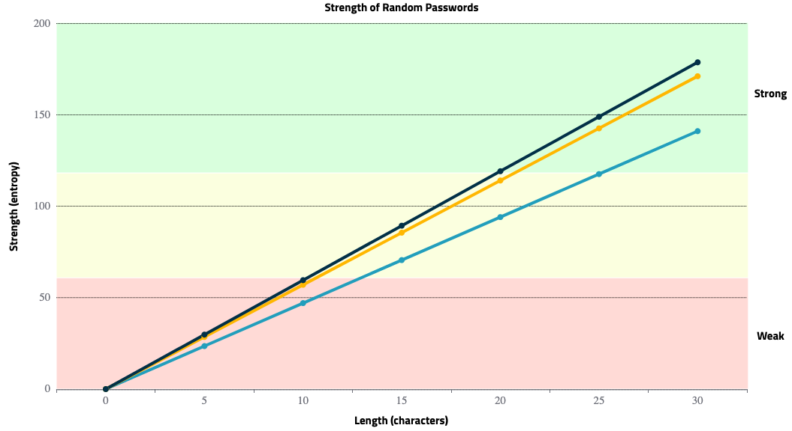

# Password Security

This document will attempt to demysitfy how passords are "hacked" and how you create strong passwords that are easy to remember. 

## How passwords are stored

In order to better understand how passwords are hacked we need to first understand how companies sore their user's passwords. Lets consider a simpe website that allows users to login using a username and password. In order to confirm that a given password is correct, companies need to store the correct password somewhere. Any sane company will NOT store `plaintext` passwords, but instead, they store passwords after `hashing` and `salting`. What does this look like? Consider the following examples to better understand how passwords are stored:

**Plaintext**

```
username    password

zack        p4ssw0rd
bob         432D]#$s3n
alice       boston12!
charlie     correcthorsebatterystaple
```

This is an exmaple of a plaintext password file. If a malicious "hacker" gained access to this file, they would IMMEDIATELY have access to every account. This is extremely unsafe!

**Hashed & Salted**

```
username    password

zack        $1$.HT8T7Ql$Kl4QAVs7LkvF7YfvEuafn/
bob         $1$7CRHLxjL$Lsd3vUJt38f1S0zEqmo6E0
alice       $1$MjjlMQIu$5LsEz6r2/9nqFiNHpsBG91
charlie     $1$mFHiQMto$TdC0zUlo8IA7n3vjbr9r5/
```

This is example of a hashed & salted password file. The previous passwords above were encrypted using the `MD5 Crypt` algorithm. If a malicious "hacker" gained access to this file, they would have to `crack` each password before gaining access to each account.

This document will not go into further detail about hashing algorithms. The main takeaway is that most companies are NOT storing `plaintext` passwords and therefore when a company is hacked and passwords are leaked that to does necesarily mean that all passwords are `cracked`.

## Password Strength

How is password strength measured? Everyone has seen websites that force users to follow certain rules:

> Your password must:
>
> - Atleast 8 characters
> - 1 Uppercase Letter
> - 1 Symbol
> - 1 Number

Users end up heeding these rules and create passwords like: `Boston99!` and `Sc00ter7`. Although these may seem like strong passwords, often they are not! Password strength can be measured in entropy bits. This is a fancy way of measuring how long it would take for hackers to `crack` your password. Entropy is calculated using the following formula:

<p align="center">
  
</p>

`S` - strength of the password

`N` - number of possible symbols (uppercase, lowercase, numbers, etc)

`L` - length of the password

<p align="center">
  
</p>

